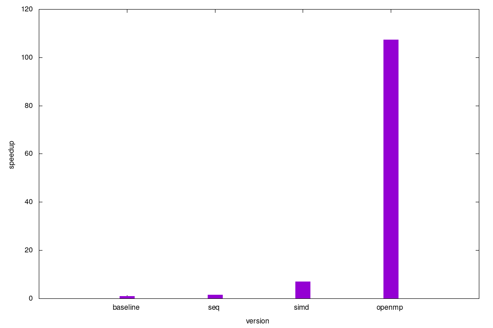

# stencil3D
Acceleration of a 3-dimensional stencil.

## Usage
### Compile
Use [CMake](https://cmake.org) build system.
```bash
mkdir build
cd build
cmake ..
make
```

### Test
```bash
make test
```

### Benchmarks
```bash
make bench
```

## Speedup results
Speedups compared to baseline version.



### To do
- [x] openmp
- [x] simd
- [ ] openacc
- [ ] tiled
- [ ] cuda

